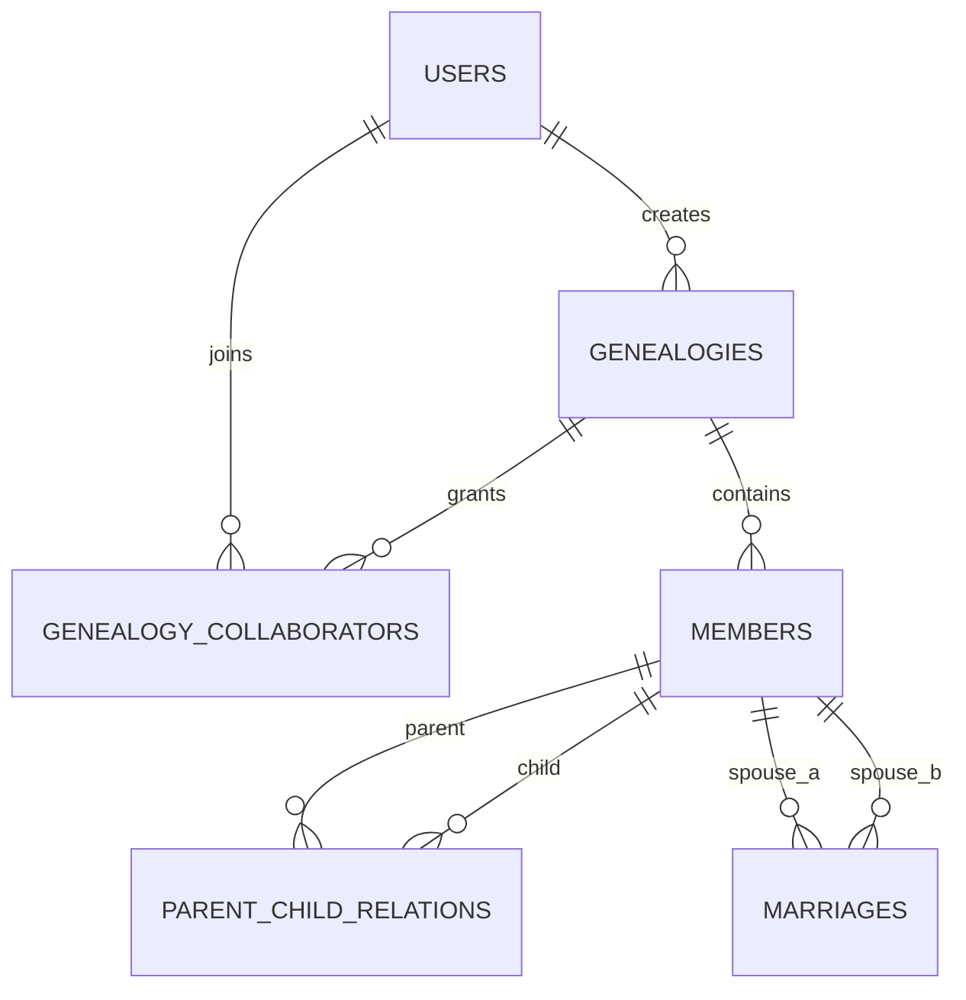

# 族谱管理系统数据库设计

## 1. 实体与联系

主要实体：

| 实体 | 关键属性 | 说明 |
| --- | --- | --- |
| User | id, username, password_hash | 注册用户 |
| Genealogy | id, name, surname, revision_time, creator_user_id | 一个家族的一本族谱 |
| Member | id, genealogy_id, name, gender, birth_year, death_year, generation, biography | 族谱人物 |
| ParentChildRelation | parent_id, child_id, relation_type | 父子、父女、母子、母女关系 |
| Marriage | id, member1_id, member2_id, married_year, ended_year, status | 婚姻关系 |
| GenealogyCollaborator | genealogy_id, user_id, role | 族谱协作者 |

联系类型：

| 联系 | 类型 | 实现方式 |
| --- | --- | --- |
| User 创建 Genealogy | 1:N | `genealogies.creator_user_id` 外键 |
| User 参与 Genealogy | M:N | `genealogy_collaborators` 连接表 |
| Genealogy 包含 Member | 1:N | `members.genealogy_id` 外键 |
| Member 作为父母连接子女 | M:N 自联系 | `parent_child_relations`，并用唯一索引限制每个孩子最多一个父亲、一个母亲 |
| Member 婚姻关系 | M:N 自联系 | `marriages`，用 `member1_id < member2_id` 避免重复方向 |

ER 图可按以下 Mermaid 绘制：



## 2. 关系模式

`users(id, username, password_hash, created_at)`

`genealogies(id, name, surname, revision_time, creator_user_id, created_at)`

`genealogy_collaborators(genealogy_id, user_id, role, invited_at)`

`members(id, genealogy_id, name, gender, birth_year, death_year, generation, biography, created_at, updated_at)`

`parent_child_relations(parent_id, child_id, relation_type, created_at)`

`marriages(id, member1_id, member2_id, married_year, ended_year, status, created_at)`

## 3. 范式说明

所有表都满足 1NF：字段保持原子值，不在单个字段中存储数组或重复组。

连接表 `genealogy_collaborators` 与 `parent_child_relations` 使用复合主键，非主属性完全依赖整个主键，满足 2NF。

各表的非主属性只依赖主键，不依赖其他非主属性。例如成员的姓名、性别、生卒年、生平简介都直接描述 `members.id` 对应的人物；族谱的姓氏、修谱时间直接描述 `genealogies.id`。因此整体达到 3NF。婚姻和父母子女关系拆成独立表，避免在成员表中存储重复的配偶、父母或子女字段。

## 4. 约束设计

主键与外键见 `schema.sql`。

重要 CHECK 与触发器：

| 约束 | 位置 | 目的 |
| --- | --- | --- |
| `gender IN ('M','F','U')` | `members` | 性别枚举 |
| `death_year >= birth_year` | `members` | 卒年不能早于出生年 |
| `parent_id <> child_id` | `parent_child_relations` | 防止自我父母关系 |
| `member1_id < member2_id` | `marriages` | 规范婚姻方向，避免重复 |
| `trg_parent_child_same_genealogy` | trigger | 父母与子女必须属于同一族谱 |
| `trg_parent_child_age` | trigger | 父母出生年必须早于子女 |
| `trg_parent_child_gender` | trigger | father/mother 关系与性别匹配 |

## 5. 索引策略

| 需求 | 索引 | 说明 |
| --- | --- | --- |
| 姓名模糊查找 | `idx_members_name`、`idx_members_genealogy_name` | SQLite 对 `%keyword%` 前缀通配的利用有限；MySQL 可改用 FULLTEXT，PostgreSQL 可用 `pg_trgm` GIN |
| 根据父节点查子节点 | `idx_parent_child_parent(parent_id, child_id)` | 树形预览、曾孙查询、后代递归都依赖该索引 |
| 根据子节点查父节点 | `idx_parent_child_child(child_id, parent_id)` | 祖先递归查询依赖该索引 |
| 按世代统计 | `idx_members_generation(genealogy_id, generation)` | 平均寿命、世代出生年分析 |
| 婚姻查询 | `idx_marriages_member1`、`idx_marriages_member2` | 快速查找配偶 |

## 6. 性能对比方法

四代查询 SQL 位于 `sql/core_queries.sql` 第 6 段。SQLite 中可以这样记录执行计划：

```sql
EXPLAIN QUERY PLAN
SELECT great_grandchild.*
FROM parent_child_relations r1
JOIN parent_child_relations r2 ON r2.parent_id = r1.child_id
JOIN parent_child_relations r3 ON r3.parent_id = r2.child_id
JOIN members great_grandchild ON great_grandchild.id = r3.child_id
WHERE r1.parent_id = 1;
```

对比步骤：

1. 保留索引运行一次，记录耗时和 `EXPLAIN QUERY PLAN`，应看到使用 `idx_parent_child_parent`。
2. 执行 `DROP INDEX idx_parent_child_parent;` 后再次运行，记录耗时和计划，通常会出现全表扫描或自动临时索引。
3. 执行 `CREATE INDEX idx_parent_child_parent ON parent_child_relations(parent_id, child_id);` 恢复索引。

