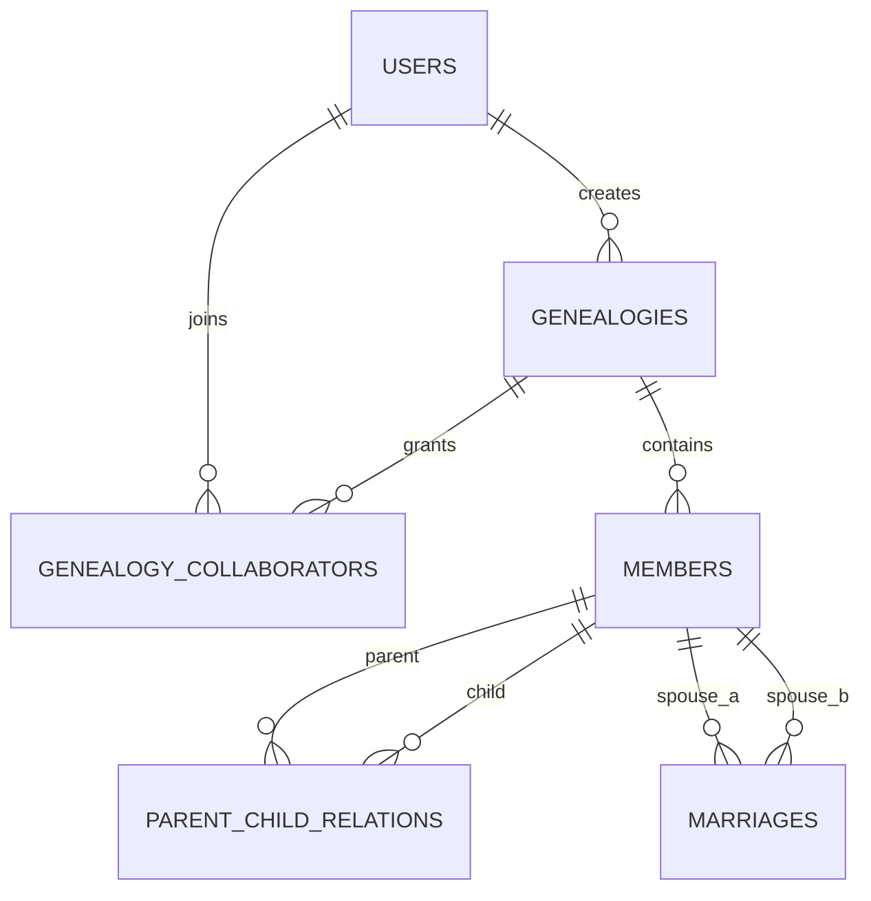

# 族谱管理系统数据库设计

## 1. 实体与联系

主要实体：

| 实体 | 关键属性 | 说明 |
| --- | --- | --- |
| User | id, username, password_hash | 注册用户 |
| Genealogy | id, name, surname, revision_time, creator_user_id | 一个家族的一本族谱 |
| Member | id, genealogy_id, name, gender, birth_year, death_year, generation, biography | 族谱人物 |
| ParentChildRelation | parent_id, child_id, relation_type | 父子、父女、母子、母女关系 |
| Marriage | id, member1_id, member2_id, married_year, ended_year, status | 婚姻关系 |
| GenealogyCollaborator | genealogy_id, user_id, role | 族谱协作者 |

联系类型：

| 联系 | 类型 | 实现方式 |
| --- | --- | --- |
| User 创建 Genealogy | 1:N | `genealogies.creator_user_id` 外键 |
| User 参与 Genealogy | M:N | `genealogy_collaborators` 连接表 |
| Genealogy 包含 Member | 1:N | `members.genealogy_id` 外键 |
| Member 作为父母连接子女 | M:N 自联系 | `parent_child_relations`，并用唯一索引限制每个孩子最多一个父亲、一个母亲 |
| Member 婚姻关系 | M:N 自联系 | `marriages`，用 `member1_id < member2_id` 避免重复方向 |

ER 图可按以下 Mermaid 绘制：



## 2. 关系模式

`users(id, username, password_hash, created_at)`

`genealogies(id, name, surname, revision_time, creator_user_id, created_at)`

`genealogy_collaborators(genealogy_id, user_id, role, invited_at)`

`members(id, genealogy_id, name, gender, birth_year, death_year, generation, biography, created_at, updated_at)`

`parent_child_relations(parent_id, child_id, relation_type, created_at)`

`marriages(id, member1_id, member2_id, married_year, ended_year, status, created_at)`

## 3. 范式说明

所有表都满足 1NF：字段保持原子值，不在单个字段中存储数组或重复组。

连接表 `genealogy_collaborators` 与 `parent_child_relations` 使用复合主键，非主属性完全依赖整个主键，满足 2NF。

各表的非主属性只依赖主键，不依赖其他非主属性。例如成员的姓名、性别、生卒年、生平简介都直接描述 `members.id` 对应的人物；族谱的姓氏、修谱时间直接描述 `genealogies.id`。因此整体达到 3NF。婚姻和父母子女关系拆成独立表，避免在成员表中存储重复的配偶、父母或子女字段。

进一步分析：

| 表 | 候选键/主键 | 主要函数依赖 | 范式结论 |
| --- | --- | --- | --- |
| `users` | `id`, `username` | `id -> username, password_hash, created_at`；`username -> id, password_hash` | BCNF；无独立多值依赖，满足 4NF |
| `genealogies` | `id`, `(creator_user_id, name)` | `id -> name, surname, revision_time, creator_user_id, created_at` | BCNF；无独立多值依赖，满足 4NF |
| `genealogy_collaborators` | `(genealogy_id, user_id)` | `(genealogy_id, user_id) -> role, invited_at` | BCNF；用户参与族谱的多值事实已独立成表，满足 4NF |
| `members` | `id` | `id -> genealogy_id, name, gender, birth_year, death_year, generation, biography` | BCNF；配偶、父母、子女等多值属性均拆出，满足 4NF |
| `parent_child_relations` | `(parent_id, child_id, relation_type)`，并由唯一索引保证 `(child_id, relation_type) -> parent_id` | 每个孩子最多一个父亲、一个母亲；每条亲子边只描述一个原子事实 | BCNF；亲子多值依赖独立成表，满足 4NF |
| `marriages` | `id`, `(member1_id, member2_id)` | `(member1_id, member2_id) -> married_year, ended_year, status` | BCNF；婚姻多值依赖独立成表，满足 4NF |

因此当前设计不是把“父亲、母亲、配偶列表、子女列表”塞进 `members`，而是把每一种独立多值关系拆成有业务含义的关系表。在不引入含义模糊中间表的前提下，核心业务表整体可说明为达到 BCNF/4NF。

## 4. 约束设计

主键与外键见 `schema.sql`。

重要 CHECK 与触发器：

| 约束 | 位置 | 目的 |
| --- | --- | --- |
| `gender IN ('M','F','U')` | `members` | 性别枚举 |
| `death_year >= birth_year` | `members` | 卒年不能早于出生年 |
| `parent_id <> child_id` | `parent_child_relations` | 防止自我父母关系 |
| `member1_id < member2_id` | `marriages` | 规范婚姻方向，避免重复 |
| `trg_parent_child_same_genealogy` | trigger | 父母与子女必须属于同一族谱 |
| `trg_parent_child_age` | trigger | 父母出生年必须早于子女 |
| `trg_parent_child_gender` | trigger | father/mother 关系与性别匹配 |

## 5. 索引策略

| 需求 | 索引 | 说明 |
| --- | --- | --- |
| 姓名模糊查找 | `idx_members_name`、`idx_members_genealogy_name` | SQLite 对 `%keyword%` 前缀通配的利用有限；MySQL 可改用 FULLTEXT，PostgreSQL 可用 `pg_trgm` GIN |
| 根据父节点查子节点 | `idx_parent_child_parent(parent_id, child_id)` | 树形预览、曾孙查询、后代递归都依赖该索引 |
| 根据子节点查父节点 | `idx_parent_child_child(child_id, parent_id)` | 祖先递归查询依赖该索引 |
| 父/母唯一定位 | `idx_parent_child_child_type(child_id, relation_type, parent_id)` | 快速定位某成员父亲或母亲，也支撑唯一性检查 |
| 按世代统计 | `idx_members_generation(genealogy_id, generation)` | 平均寿命、世代出生年分析 |
| 世代与出生年排序 | `idx_members_genealogy_generation_birth(genealogy_id, generation, birth_year, id)` | 成员列表、树形子节点排序、按世代分析减少额外排序 |
| 生命统计 | `idx_members_life_stats(genealogy_id, gender, birth_year, death_year)` | 支撑“50 岁以上且无配偶男性”等筛选 |
| 婚姻查询 | `idx_marriages_member1`、`idx_marriages_member2` | 快速查找配偶 |
| 婚姻状态 | `idx_marriages_pair_status(member1_id, member2_id, status)` | 支撑按夫妻对和婚姻状态过滤 |

姓名检索同时设计了 `members_fts` FTS5 虚拟表，由 `trg_members_fts_insert/update/delete` 自动维护。SQLite 环境中优先走全文索引，若运行环境不支持或没有初始化 FTS 表，应用会回退到 `LIKE '%keyword%'`，保证功能可用。

## 6. 性能对比方法

四代查询 SQL 位于 `sql/core_queries.sql` 第 6 段。SQLite 中可以这样记录执行计划：

```sql
EXPLAIN QUERY PLAN
SELECT great_grandchild.*
FROM parent_child_relations r1
JOIN parent_child_relations r2 ON r2.parent_id = r1.child_id
JOIN parent_child_relations r3 ON r3.parent_id = r2.child_id
JOIN members great_grandchild ON great_grandchild.id = r3.child_id
WHERE r1.parent_id = 1;
```

对比步骤：

1. 保留索引运行一次，记录耗时和 `EXPLAIN QUERY PLAN`，应看到使用 `idx_parent_child_parent`。
2. 执行 `DROP INDEX idx_parent_child_parent;` 后再次运行，记录耗时和计划，通常会出现全表扫描或自动临时索引。
3. 执行 `CREATE INDEX idx_parent_child_parent ON parent_child_relations(parent_id, child_id);` 恢复索引。

## 7. 事务与并发控制

应用连接数据库时启用：

| 设置 | 作用 |
| --- | --- |
| `PRAGMA foreign_keys = ON` | 强制外键约束，避免孤立成员或孤立关系 |
| `PRAGMA journal_mode = WAL` | 读写分离日志模式，提高“验收查询 + 后台录入”并发能力 |
| `PRAGMA synchronous = NORMAL` | 在 WAL 模式下降低同步开销，兼顾可靠性与性能 |
| `PRAGMA busy_timeout = 5000` | 写锁竞争时等待 5 秒，减少并发提交时直接报错 |

应用写操作统一通过 `with db:` 包裹，单次成员新增、关系新增、婚姻新增等要么整体提交，要么触发约束后整体回滚。

## 8. 树形查询优化

树形预览不再按 BFS 或 `depth` 排序平铺，而是先读取当前族谱的成员、亲子边和婚姻边，在内存中建立 `parent_id -> children` 与 `member_id -> spouses` 映射，然后用 DFS 构造嵌套树：

1. 先显示根祖先。
2. 对每个子女完整展开其全部后代子树。
3. 再回到同代下一个子女。
4. 节点卡片同时显示配偶关系，子树连线显示亲子层级。

这样验收时能直观看到“某个祖先的一个分支完整传承到末代，再进入下一个分支”，不会出现同一代成员混在一起、父子关系需要猜的情况。

## 9. 查询中心优化

大族谱中如果把 50,000 名成员全部渲染为 `<select><option>`，单个查询页会产生十几万行 HTML，浏览器会明显卡顿。因此查询中心改为：

| 优化点 | 说明 |
| --- | --- |
| ID 精确输入 | 表单使用成员 ID 数字输入，不再渲染全量成员下拉框 |
| 示例 ID | 页面只展示前 12 个常用成员作为提示 |
| 祖先去重遍历 | 深代成员的父母双边递归可能产生重复路径；应用层按当前族谱构建 `child -> parents` 映射，每个祖先只访问一次 |
| 亲缘 BFS | 亲缘链路查询按当前族谱构建邻接表，用 BFS 找最短路径，避免 SQL 递归在全库图上扩散 |
| 结果限量 | 后代、祖先、统计列表均设置展示上限，保证验收演示时响应稳定 |

真实大族谱采样中，查询中心初始页、平均寿命统计、世代画像、亲缘链路、祖先查询都能在毫秒到几十毫秒级返回。
